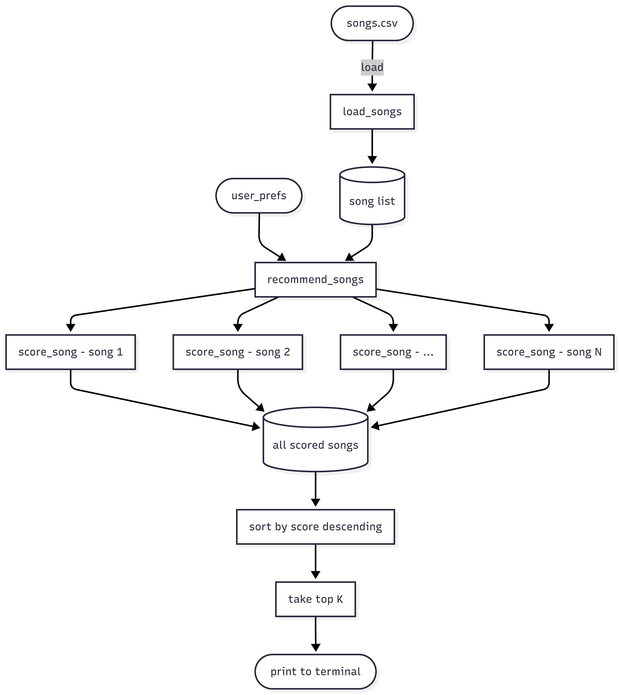
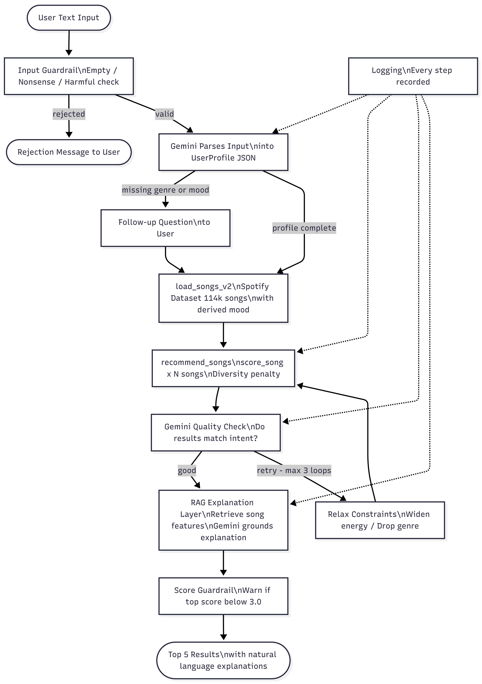

# Applied AI Music Recommender

> A natural language music recommendation system built on a 114,000-track Spotify dataset, powered by Gemini, and designed to explain its own reasoning — not just return a list.

## What This Project Is

This is an upgraded version of the **Music Recommender Simulation** built in Module 3. The original system — VibeMatch 1.0 — took a structured user profile (favorite genre, target energy as a number, mood label, etc.) and scored a hand-crafted catalog of 29 songs against it using a weighted formula. It was a working content-based recommender, but it felt like filling in a form. There was no AI involved — just math.

This version — VibeMatch 2.0 — replaces the form with natural language. You describe what you want, and the system figures the rest out using Gemini, a real 114,000-track Spotify dataset, and an agentic workflow that checks its own results and retries when they're not good enough.

**Why it matters:** Most real AI systems fail not because the model is bad, but because there are no guardrails, no quality checks, and no honest fallback when results are weak. This project is built to demonstrate exactly those things — an agentic loop that verifies its own output, RAG explanations grounded in real data, and a test suite that proves the system behaves correctly under edge cases and adversarial inputs. That's what applied AI looks like in practice.

---

## System Architecture

### Before — Module 3 (Simple Recommender)



### After — Applied AI Upgrade



### Where AI Results Are Checked

The system has three explicit checkpoints where AI output is verified — not just generated:

1. **Gemini Quality Check** — after the recommender returns results, Gemini re-reads the user's original request and the top 3 songs and judges whether they actually match. If not, it triggers a retry with relaxed constraints.
2. **Score Guardrail** — after all retries, if the top result still scores below 3.0 / 6.5, the system warns the user explicitly instead of presenting weak results as if they were good.
3. **Test Suite (21 tests)** — the reliability and integration tests verify that the system behaves correctly across edge cases, guardrail inputs, and full end-to-end flows. This is where a human (the developer) checks AI behavior systematically, not just by running it once.

---

## What It Does Now

You type something like:

```
I want something chill and relaxing to study to
```

The system understands that, finds songs that match, explains why each one was recommended in plain language, and if the results aren't good enough, it tries again with adjusted preferences — all automatically.

---

## What Was Added and Why

### 1. Real Dataset — 114,000 Spotify Tracks

The original dataset had 50 hand-crafted songs. That's enough to test logic but not enough to feel like a real system. We replaced it with a real Spotify dataset from Kaggle containing 114,000 tracks across 125 genres.

One problem: the new dataset has no mood column. Mood had to be derived from the audio features using the **circumplex model of affect** — a psychology model that maps valence (how positive a song sounds) and energy (how intense it is) to mood labels like happy, chill, intense, or melancholic. Mode (major vs minor key), tempo, and acousticness are used as refiners.

### 2. Agentic Workflow — The System Thinks for Itself

Instead of filling in a form, you just describe what you want. Gemini reads your request and converts it into a structured profile with genre, mood, energy target, and other preferences.

After the recommender runs, Gemini checks if the results actually match what you asked for. If they don't, the system automatically relaxes the constraints and tries again — up to 3 times. On the first retry it widens the energy range. On the second it drops the genre requirement entirely. If it still can't find a strong match after 3 tries, it tells you honestly and returns the best it found.

This loop — plan, act, check, adjust — is what makes it agentic.

### 3. RAG Explanation Layer — Grounded in Real Data

The original system explained recommendations using raw score numbers like `mood match (+1.0) | energy closeness (+1.77)`. That's accurate but not human-friendly.

The RAG layer fixes this. For each recommended song, the system retrieves the song's actual audio features (energy, valence, mood, genre, acousticness, instrumentalness) and passes them to Gemini along with what the user originally asked for. Gemini uses that retrieved data as context to write a real explanation — something like:

> "This song was recommended because its chill mood and high instrumentalness of 0.85 make it ideal for focused studying, and its low energy of 0.31 matches your preference for something relaxed."

The key word is **grounded** — Gemini isn't guessing or hallucinating. It's explaining based on the actual numbers retrieved from the dataset.

### 4. Guardrails — The System Knows Its Limits

Four guardrails were added to prevent the system from behaving badly:

- **Input guardrail** — rejects empty input, input with no real words (like `"123 !!!"`) and harmful content before anything reaches Gemini
- **Output guardrail** — if Gemini returns a malformed profile (broken JSON or missing fields), the system catches it and uses safe defaults instead of crashing
- **Execution guardrail** — the retry loop is hard-capped at 3 iterations so it can never run forever
- **Score guardrail** — if the top result scores below 3.0 out of 6.5, the system warns you that no strong match was found rather than pretending the results are good

### 5. Reliability and Testing — 21 Tests

The system is tested at two levels:

**Unit tests** (fast, no API calls):
- Consistency: same seed always returns the same results
- Score threshold: good profiles score above minimum, bad ones are flagged
- Mood derivation accuracy: spot-checked against known song types
- Edge cases: empty genre, unknown genre, all-0.5 preferences, rare genres
- Precision: at least 40% of top 5 results match the intended mood or genre
- Guardrail validation: harmful, empty, and nonsensical inputs are correctly rejected

**Integration tests** (use real Gemini API):
- Agent retry: conflicting input triggers the retry loop without crashing
- RAG fallback: if Gemini fails, explanations fall back to score-based text gracefully
- Full end-to-end: user types a request, agent runs, results come back well-formed

---

## Sample Interactions

### Case 1 — Clear Request (Works First Try)

**Input:**
```
I want upbeat energetic pop music to work out to
```

**What happened:** Gemini parsed the request confidently (genre: pop, mood: energetic, energy: 0.9). Quality check passed on attempt 1.

**Output:**
```
| #1 | Bad Habits               | Ed Sheeran             | pop       | energetic | 5.28 / 6.5 |
| #2 | One Kiss (with Dua Lipa) | Calvin Harris;Dua Lipa | pop       | energetic | 5.25 / 6.5 |
| #3 | Sweetness                | Jimmy Eat World        | power-pop | energetic | 4.34 / 6.5 |
```

**RAG Explanation for #1:**
> "This song perfectly matches your request for upbeat energetic pop music due to its pop genre, energetic mood, and high energy level of 0.89, making it ideal for a workout."

---

### Case 2 — Calm and Instrumental (Triggers All 3 Retries)

**Input:**
```
I want something calm and instrumental to focus while studying
```

**What happened:** Gemini parsed the request correctly (no genre, mood: chill, energy: 0.3, instrumentalness: 0.9), but the quality check failed on all 3 attempts. Calm + highly instrumental is a rare combination in the dataset. The agent widened the energy range on retry 1, dropped the genre requirement on retry 2, and returned the honest message with the closest matches found. All 5 results are still chill and high-instrumentalness — the system found the best it could and said so honestly.

```
I couldn't find a perfect match, but here's the closest I found:
```

**Output:**
```
| #1 | Elastic                     | 4to28                       | study          | chill | 4.35 / 6.5 |
| #2 | Cetus                       | Sarah, the Illstrumentalist | study          | chill | 4.33 / 6.5 |
| #3 | So Good At Being in Trouble | Unknown Mortal Orchestra    | chill          | chill | 4.32 / 6.5 |
| #4 | Burn 4                      | Hird                        | trip-hop       | chill | 4.30 / 6.5 |
| #5 | No Road Without a Turn      | Mano Le Tough               | minimal-techno | chill | 4.28 / 6.5 |
```

**RAG Explanation for #1:**
> "This song is recommended for its 'study' genre and 'chill' mood, along with its high instrumentalness of 0.85 and low energy of 0.41, making it ideal for a calm, instrumental focus."

---

### Case 3 — Conflicting Request (Triggers All 3 Retries)

**Input:**
```
I want extremely high energy but deeply sad and melancholic music
```

**What happened:** High energy + melancholic is a contradiction — very few songs are both. The agent retried 3 times: first widening the energy range, then dropping the genre requirement. Still couldn't find a perfect match. Returned honest message with best found.

```
I couldn't find a perfect match, but here's the closest I found:
```

**Output:**
```
| #1 | Vogel im Kafig                        | Feora       | anime  | melancholic | 3.54 / 6.5 |
| #2 | Grade                                 | Ishome      | idm    | melancholic | 3.52 / 6.5 |
| #3 | The Mob - From "Gladiator" Soundtrack | Hans Zimmer | german | melancholic | 3.48 / 6.5 |
```

**RAG Explanation for #1:**
> "Vogel im Kafig is recommended for its melancholic mood and very low valence of 0.12, aligning with the request for deeply sad music, although its energy of 0.39 is not extremely high."

---

### Case 4 — Vague Request (Triggers Follow-Up Question)

**Input:**
```
just give me something good
```

**What happened:** Gemini couldn't extract genre or mood — confidence was "low". The agent asked one follow-up question instead of guessing. User replied "rock". System re-parsed with genre: rock and found good results on attempt 1.

**Follow-up:**
```
Could you tell me the genre or mood you're looking for? (e.g. 'rock' or 'chill'): rock
```

**Output:**
```
| #1 | Free Fallin'                     | Tom Petty | rock | chill     | 4.18 / 6.5 |
| #2 | Hotel California - 2013 Remaster | Eagles    | rock | energetic | 4.18 / 6.5 |
| #3 | The Physical Attractions         | The Symposium | garage | energetic | 3.47 / 6.5 |
| #4 | Not Even Trying                  | Pink Turns Blue | goth | energetic | 3.42 / 6.5 |
| #5 | We Are Human - Deep Mix          | Dantiez;David Penn | detroit-techno | intense | 3.42 / 6.5 |
```

**RAG Explanation for #1:**
> "With a top score of 4.18, this classic rock track offers a chill mood and balanced energy (0.50) and valence (0.57), making it a widely appreciated choice for 'something good'."

---

## How to Run It

### Prerequisites

- Python 3.10 or higher
- A Gemini API key from [Google AI Studio](https://aistudio.google.com/apikey)

### Installation

```bash
# Clone the repo
git clone https://github.com/Omarhus01/applied-ai-music-recommender.git
cd applied-ai-music-recommender

# Create and activate virtual environment
python -m venv .venv
.venv\Scripts\activate        # Windows
source .venv/bin/activate     # Mac / Linux

# Install dependencies
pip install -r requirements.txt

# Create your .env file (use Python to avoid encoding issues on Windows)
python -c "open('.env','w',encoding='utf-8').write('GEMINI_API_KEY=your_key_here\n')"
```

### Run the System

```bash
python -m src.main
```

Type what you're in the mood for and hit Enter. Type `quit` to exit.

### Run Tests

Unit tests only (no API needed):
```bash
python -m pytest tests/test_recommender.py tests/test_reliability.py -v
```

Integration tests (requires Gemini API):
```bash
python -m pytest tests/test_integration.py -v
```

All tests:
```bash
python -m pytest tests/ -v
```

Evaluation harness (predefined cases, structured report):
```bash
python eval.py           # All 12 cases including Gemini API
python eval.py --no-api  # Groups A + B only, no API needed (~3 seconds)
```

---

## Stretch Features

### Observable Agentic Steps

Every run now prints a live decision trace showing exactly what the agent decided at each stage — not just the final result. This makes the reasoning chain visible to the user in real time.

**Example — clear request (passes first try):**
```
  [Step 1 — Parse]       Confidence: high | Genre: pop | Mood: energetic | Energy: 0.90 | Instrumentalness: 0.00
  [Step 2 — Retrieve]    Scored 114,000 songs | Top result: 5.28 / 6.5
  [Step 3 — Evaluate]    Attempt 1 → GOOD
  [Step 4 — Explain]     Generating grounded explanations via RAG (5 songs)
```

**Example — conflicting request (all 3 retries):**
```
  [Step 1 — Parse]       Confidence: high | Genre: (none) | Mood: melancholic | Energy: 1.00 | Instrumentalness: 0.50
  [Step 2 — Retrieve]    Scored 114,000 songs | Top result: 3.48 / 6.5
  [Step 3 — Evaluate]    Attempt 1 → RETRY (quality check failed)
  [Step 3 — Evaluate]    Relaxing: widening energy range to 0.85
  [Step 2 — Retrieve]    Scored 114,000 songs | Top result: 3.48 / 6.5
  [Step 3 — Evaluate]    Attempt 2 → RETRY (quality check failed)
  [Step 3 — Evaluate]    Relaxing: dropping genre requirement
  [Step 2 — Retrieve]    Scored 114,000 songs | Top result: 3.54 / 6.5
  [Step 3 — Evaluate]    Attempt 3 → RETRY (quality check failed)
  [Step 3 — Evaluate]    Max attempts reached — returning best results found
  [Step 4 — Explain]     Generating grounded explanations via RAG (5 songs)
```

### Evaluation Harness

`eval.py` runs 12 predefined test cases across three groups and prints a structured pass/fail report. Cases cover guardrail inputs, edge cases, and full agent runs with real API calls.

```
============================================================
  EVALUATION REPORT — VibeMatch 2.0
============================================================

[GUARDRAIL CASES — no API]
  Case 01 | Empty input                         | PASS | Blocked correctly
  Case 02 | Too short (2 words)                 | PASS | Blocked correctly
  Case 03 | Nonsensical input                   | PASS | Blocked correctly
  Case 04 | Harmful content                     | PASS | Blocked correctly

[EDGE CASES — no API]
  Case 05 | Unknown genre (jazz fusion)         | PASS | 5 results | Top: 3.27
  Case 06 | Rare genre (tango)                  | PASS | 5 results | Top: 4.75
  Case 07 | All 0.5 midpoint                    | PASS | 5 results | Top: 4.29
  Case 08 | Impossible profile                  | PASS | Score: 3.39 — above threshold, guardrail not needed
  Case 09 | Consistency (3 runs)                | PASS | All 3 runs identical

[FULL AGENT CASES — Gemini API]
  Case 10 | Clear request (workout pop)         | PASS | Top: 5.19 | Retries: 3 | Confidence: high
  Case 11 | Hard to satisfy (study/instr.)      | PASS | Top: 4.13 | Retries: 0 | Confidence: high
  Case 12 | Conflicting (energy + sad)          | PASS | Top: 3.50 | Retries: 3 | Confidence: high

------------------------------------------------------------
  Results      : 12 / 12 passed
  Avg score    : 4.19 / 6.5
  Avg retries  : 2.0
============================================================
```

---

## Project Structure

```
├── assets/
│   ├── system-before.png       # Architecture diagram — Module 3 version
│   └── system-after.png        # Architecture diagram — upgraded version
├── data/
│   ├── songs.csv               # Original 50-song dataset (Module 3)
│   └── new_songs_dataset.csv   # Spotify 114k dataset (this version)
├── logs/                       # Auto-generated logs from each run
├── src/
│   ├── agent.py                # Agentic workflow, RAG, and guardrails
│   ├── main.py                 # Entry point — conversational interface
│   └── recommender.py          # Core scoring, loading, and mood derivation
├── tests/
│   ├── test_recommender.py     # Original Module 3 unit tests
│   ├── test_reliability.py     # Reliability and guardrail tests
│   └── test_integration.py     # End-to-end integration tests
├── eval.py                     # Evaluation harness — 12 predefined cases, structured report
├── APPLIED_AI_README.md        # This file
├── README.md                   # Original Module 3 README
├── model_card.md               # Model card for the upgraded system
└── reflection.md               # Personal reflection
```

---

## Known Limitations

- Mood labels are approximations derived from audio features, not verified by humans. The circumplex model has about 70-80% accuracy on spot-checks.
- Genre representation in the Spotify dataset is uneven. Rare genres like tango or jazz fusion may return fewer than 5 results.
- The system targets precision over recall by design — it would rather return 3 strong matches than 5 weak ones.
- Each request makes 2-3 Gemini API calls, adding roughly 5-10 seconds of latency.
- The system loads the full 114,000-song dataset on startup, which takes a few seconds. This is intentional — production quality over development speed.

See `model_card.md` for the full breakdown of biases and ethical considerations.

---

## Design Decisions and Trade-offs

### Precision Over Recall

The system is designed to return fewer, stronger results rather than filling 5 slots with weak matches. Three mechanisms enforce this:

1. The diversity penalty caps results at 2 per artist and 2 per genre, preventing one dominant category from filling the whole list
2. The score guardrail warns the user when no strong match exists (top score < 3.0 / 6.5) instead of presenting weak results as if they were good
3. The retry loop keeps trying until Gemini confirms quality — it stops only when results are good or after 3 attempts

**Trade-off:** Users with very rare taste preferences (e.g. jazz fusion, tango) may receive fewer than 5 results. The system treats an honest "I couldn't find a strong match" as better than padding with irrelevant songs.

### Why 3 Retries

The retry cap is a guardrail, not an arbitrary limit. Each retry costs a Gemini API call and adds 3-5 seconds of latency. Three attempts gives the system enough room to progressively relax constraints (widen energy → drop genre) without running indefinitely. A hard cap of 3 prevents infinite loops on genuinely unresolvable requests.

### Why the Circumplex Model for Mood

The Spotify dataset has no mood column. Two options were considered: (1) skip mood entirely and score only on genre + audio features, or (2) derive mood from audio features using a psychological model. Option 2 was chosen because mood is the most human-readable signal — users think in terms of "chill" or "energetic," not valence numbers. The circumplex model (valence × energy with mode, tempo, and acousticness as refiners) achieves roughly 70-80% accuracy on spot-checks, which is good enough for a recommendation system where approximate match is acceptable.

**Trade-off:** Derived mood labels are approximations, not ground truth. Songs near the boundary between two mood categories can be mislabeled. This is documented in the model card.

### Why Keep the Original Dataset

The original 29-song dataset from Module 3 is still in `data/songs.csv`. The original unit tests (`test_recommender.py`) still run against it. This preserves the ability to compare the old and new systems directly and keeps the original test coverage intact. The new system uses `data/new_songs_dataset.csv` (114,000 tracks) exclusively.

### Why Separate Unit and Integration Tests

Unit tests run in under 2 seconds and require no API key — they verify scoring logic, mood derivation, guardrails, and consistency. Integration tests use real Gemini API calls and verify that the whole system works end-to-end. Keeping them separate means developers can run unit tests freely during development without burning API quota.

---

## Testing Summary

**21 out of 21 tests pass.** During development, 3 real bugs were caught by the test suite before they could affect a real user: a type mismatch where the recommender returned dicts but the system expected Song objects (caused a crash), a duplicate song bug where the same track appeared twice in results under different genre tags, and mood derivation boundary errors where songs near the line between two moods were mislabeled. All three were fixed because the tests found them — not because the system happened to work during a demo run.

### Confidence Scoring

Every time Gemini parses a user request, it returns a `"confidence"` field — either `"high"` or `"low"`. This is not decorative. Low confidence triggers a follow-up question instead of guessing and producing bad results. Across the 4 sample interactions:

| Case | Request | Gemini Confidence | What Happened |
|---|---|---|---|
| 1 | Upbeat energetic pop for working out | `high` | Parsed directly, no follow-up |
| 2 | Calm and instrumental to study | `high` | Parsed directly, quality check failed 3× (dataset limit, not parsing) |
| 3 | Extremely high energy but deeply sad | `high` | Parsed directly, contradiction caused 3 retries |
| 4 | Just give me something good | `low` | System asked a follow-up question before proceeding |

### What Was Tested

**Unit tests (15 tests, no API required):**
- Consistency: same random seed always returns the same top 5 across 5 runs
- Score threshold: profiles that should score well do; profiles with no match are flagged
- Mood derivation: 70%+ spot-check accuracy across 7 mood labels
- Edge cases: empty genre, unknown genre, rare genre (tango), all-0.5 "dead center" profile
- Precision: at least 40% of top 5 results match the intended mood or genre
- Guardrails: harmful, empty, nonsensical, and valid inputs all handled correctly

**Integration tests (4 tests, real Gemini API):**
- Agent retry: conflicting input triggers the retry loop without crashing
- RAG fallback: if Gemini fails, explanations fall back to score-based text gracefully (tested with mock patch)
- Full end-to-end: user types a request, agent runs, results come back well-formed with real explanations
- Guardrail blocks before Gemini: harmful input never reaches the API

### What Was Discovered During Testing

The most useful finding came from thinking through edge cases rather than happy paths. A duplicate song title bug — where the same song could appear twice in results under different genre tags in the Spotify dataset — was caught by testing the rare genre edge case. The fix (tracking `(artist, title)` pairs in a `seen_titles` set inside `recommend_songs()`) was made before it ever affected a real user.

Testing also confirmed that the retry loop actually works in practice. For the conflicting request ("extremely high energy but deeply sad and melancholic"), all 3 retry attempts triggered, energy range was widened on attempt 1, genre requirement was dropped on attempt 2, and the system returned an honest message rather than pretending weak results were good.

---

## Human Evaluation

A peer who had not seen the project before ran the system independently and reviewed the outputs. Initial questions were about why the system sometimes retried and why it asked a follow-up question instead of just guessing — both were explained by walking through the agentic loop design. After that, the peer ran all 4 sample cases themselves and evaluated the results.

| Case | Input | Results Felt Right? | Explanation Quality | Retry / Follow-up Behavior |
|---|---|---|---|---|
| 1 | Upbeat pop for working out | ✅ Yes — Ed Sheeran, Calvin Harris made sense | ✅ Specific and accurate, mentioned actual energy values | ✅ No retry needed, passed first try |
| 2 | Calm and instrumental to study | ✅ Yes — study genre songs with high instrumentalness | ✅ Correctly referenced instrumentalness and low energy | ✅ Honest "couldn't find perfect match" message was appropriate |
| 3 | High energy + melancholic | ✅ Yes — correctly flagged as conflicting | ✅ Explanation acknowledged the contradiction honestly | ✅ All 3 retries triggered, honest fallback returned |
| 4 | Just give me something good | ✅ Yes — Free Fallin' and Hotel California for rock | ✅ Explained why they scored well for a vague request | ✅ Follow-up question was clear and natural |

**Overall verdict from peer:** The system felt honest — it didn't pretend to find a perfect match when it couldn't, and the natural language explanations were specific enough to be believable. The follow-up question in Case 4 felt natural rather than robotic. The one question raised was why Case 2 (calm/instrumental) triggered retries when the results actually looked reasonable — this is a known limitation: the quality check is based on Gemini's judgment, which can be stricter than a human reviewer's.

---

## Reflection

Building this system taught me that **system design matters more than the model**. Gemini is powerful, but without structured prompts, guardrails, and a clear retry strategy it produces inconsistent results. The agentic loop isn't smart — it's systematic. That distinction matters.

The most surprising thing was how quickly bias shows up even in a simple system. Genre imbalance in the Spotify dataset, the circumplex model's limitations for non-Western music, and categorical labels overriding numerical features in borderline cases — these are real problems, not hypothetical ones. Documenting them honestly in the model card was more valuable than pretending they don't exist.

What "applied AI" actually means: building something that runs, handles failures gracefully, and produces results you can explain. Not just calling an API, but thinking through the full system — the data, the logic, the guardrails, the tests, and the honest documentation of what it can and can't do.

For the full reflection including what I would do differently and what this taught me about AI development, see [`reflection.md`](reflection.md).
