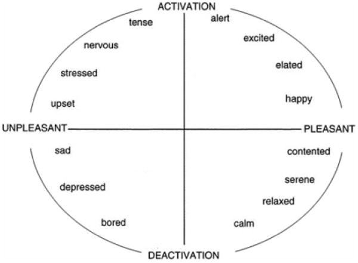
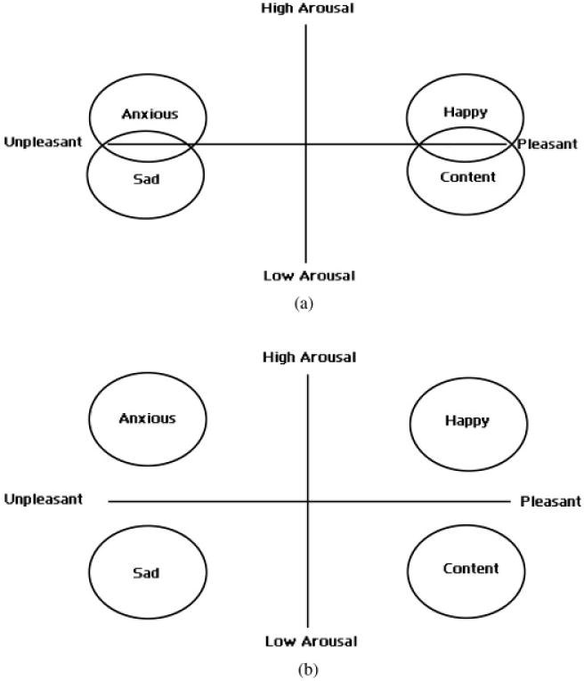

# Reflection — Applied AI Music Recommender

---

## 1. What I Built and How It Works

### Where It Started

I started with the Module 3 music recommender — a system that scored songs against a structured user profile using a weighted formula. It worked, but it felt rigid. You had to know exactly what genre you wanted, what your target energy was, whether you liked acoustic music. Nobody talks like that.

### What Changed

The upgrade turns it into something that actually feels natural. You type what you're in the mood for and the system figures out the rest:

- **Gemini** reads your request and converts it into a structured profile
- The **recommender** scores songs from a 114,000-track Spotify dataset against that profile
- **Gemini checks** whether the results actually match what you asked for
- If they don't, it **adjusts and retries** — up to 3 times automatically
- Each song gets a **natural language explanation** grounded in its actual audio features

### The Dataset Challenge

The new Spotify dataset had no mood column. Mood had to be derived from audio features using the **circumplex model of affect** — a psychology model that maps energy and valence to emotions like happy, chill, intense, or melancholic. Mode (major/minor key), tempo, and acousticness were used as refiners. That was one of the more interesting problems because the system had to make a judgment call about how a song *feels*, not just what genre it is.

---

## 2. Which AI Features I Added and Why

I added three of the four possible features:

| Feature | Why I Chose It |
|---|---|
| Agentic Workflow | Made the biggest difference to how the system feels — conversation instead of a form |
| RAG | Raw score numbers mean nothing to a real user — grounded explanations fix that |
| Reliability Testing | Working code is not the same as good logic — I needed to actually verify behavior |

### Agentic Workflow

The loop of **parse → recommend → check → retry** is what makes it feel like the system is thinking, not just calculating. I also liked that it forces the system to be honest — if it can't find a good match after three tries, it tells you that instead of pretending.

### RAG

The key thing I understood from the course is that RAG is not about letting AI guess — it's about giving the AI real data to work with so it can't hallucinate. The song's actual features (energy, valence, mood, genre) are the retrieved context. Gemini uses those to write something meaningful instead of making things up.

### Reliability Testing

The course was clear: working code is not the same as good logic. I wanted to verify the system actually behaves correctly, not just that it runs.

---

## 3. How I Approached Testing

### The Mindset

I started by thinking about what could go wrong rather than what should work. That's something the course emphasized — edge cases are where systems actually fail.

### Unit Tests (No API — Fast)

- Empty genre, unknown genre, rare genre (tango)
- All-0.5 preferences (the "dead center" profile)
- Consistency: same random seed always returns the same top 5
- Precision: at least 40% of top 5 results match the intended mood or genre
- All guardrails: harmful, empty, and nonsensical inputs correctly rejected

### Integration Tests (Real Gemini API)

- **RAG fallback**: simulated Gemini failing — verified the system doesn't crash, just falls back to score-based explanations
- **Agent retry**: gave the system a conflicting input and verified the retry loop triggers without breaking
- **Full end-to-end**: user types a request, agent runs, results come back well-formed with real explanations
- **Guardrail integration**: harmful input never reaches Gemini at all

### What Testing Revealed

The duplicate song title bug — where the same song could appear twice in results under different genre tags — only became obvious when thinking through edge cases. I fixed it before it ever caused a real problem. That's the point of testing.

---

## 4. What Surprised Me

### The API Quota Problem

I didn't expect free tier limits to be hit so quickly. Dealing with that took real time — switching accounts, setting up billing, figuring out which model names were still available. It taught me something practical: any real AI system needs billing and rate limit handling from the start, not as an afterthought.

### The Retry Loop

I assumed Gemini would always return good results on the first try. In reality, for conflicting or vague requests it often needed to retry. Watching the retry logic actually trigger and seeing the results improve was genuinely satisfying — it meant the agentic design was actually working.

---

## 5. What I Would Do Differently

- **Switch to the full 114k dataset earlier in development** — I used a 10,000-song sample during development and switched to the full dataset before final submission, but testing on the full scale earlier would have caught any scale-related issues sooner
- **Add multi-turn conversation** — right now every request is independent. A real system would let you say "give me something more upbeat" without starting over
- **Add human-verified mood labels** — the circumplex model is a good approximation but a small labeled dataset would make mood derivation much more accurate

---

## 6. Ethics and Critical Reflection

### Limitations and Biases in This System

Four real biases exist in this system and are documented honestly rather than hidden:

- **Genre imbalance** — the Spotify dataset has thousands of pop tracks and fewer than 50 for genres like tango or jazz fusion. Users with rare genre preferences consistently get fewer and weaker results. The system warns them with a score guardrail instead of silently returning irrelevant songs.
- **Circumplex model bias** — mood derivation is based on Western psychological research mapping valence and energy to emotional states. This model doesn't translate accurately to non-Western music traditions where the same audio features map to different emotional experiences.
- **Language skew** — the dataset skews heavily toward English-language music. Non-English tracks are underrepresented, which affects results for users with preferences tied to non-English genres.
- **Categorical dominance** — genre and mood matches add fixed bonus points regardless of how well the song's actual sound matches. In borderline cases, a song can rank highly because its label matches even if its sound doesn't. This was observed and documented in the Module 3 profile comparisons and is still present in the upgraded system.

### Could This System Be Misused?

The system's primary misuse risk is the input itself — users could submit harmful, manipulative, or nonsensical content hoping to get Gemini to behave unexpectedly. The input guardrail addresses this directly: harmful keywords are blocked before anything reaches Gemini, and inputs with fewer than 3 real words are rejected with a clear message. The guardrail is intentionally conservative — it would rather reject an edge-case valid request than pass a harmful one through.

A secondary risk is data privacy: user requests in natural language are sent to Google's Gemini API for processing. The system does not store requests or session history between runs, but users should be aware their input leaves the local machine. This is documented in the model card.

### What Surprised Me During Reliability Testing

The biggest surprise was that the quality check — where Gemini judges whether its own results are good — turned out to be stricter than a human reviewer would be. In Case 2 (calm and instrumental for studying), the results that came back were genuinely reasonable: all five songs were chill, high-instrumentalness, and from a study genre. But Gemini failed them 3 times and triggered the "couldn't find a perfect match" message. A real user looking at those results would probably have been satisfied. This revealed something important: automated quality checks measure conformance to a definition of "good," not whether a real user would be happy. Those are not always the same thing.

The second surprise was how quickly testing caught real bugs. I expected tests to confirm the system worked. Instead, they found a type mismatch crash, a duplicate song bug, and mood derivation boundary errors — all before the system was shown to anyone. That changed how I think about testing. It's not a checkbox. It's the thing that makes the system trustworthy.

### Collaboration With AI During This Project

AI was used throughout this project for planning, code generation, debugging, and documentation. One instance where it was genuinely helpful and one where it fell short:

**Helpful — Planning Before Coding**

Before writing a single line of the agentic workflow, we analyzed the full system design: what the retry loop needed to do, how the guardrails would interact with it, what each phase would require. That structured planning session prevented several design mistakes that would have required rewrites later. The AI's value here wasn't in writing code — it was in asking "have you thought about what happens when Gemini fails?" and "what does the system do if all 3 retries fail?" before those became bugs.

**Flawed — Mood Accuracy Suggestion**

When the mood derivation system needed to be built (the Spotify dataset has no mood column), the initial AI suggestion was generic: "use high energy + high valence for happy, low energy + low valence for sad." That's a reasonable starting point but it produced inaccurate results on boundary cases and had no scientific grounding.

The actual solution came from going to the primary literature independently. Russell (1980) published the **circumplex model of affect** — a psychology model that places emotions on a two-dimensional space defined by valence (pleasant vs unpleasant) and arousal/activation (high vs low energy). Every emotional state occupies a position on this circle, which means you can map any valence + energy combination to a mood label with a clear scientific basis.

**Russell's original circumplex model:**

*Source: Russell, J.A. (1980). A circumplex model of affect. Journal of Personality and Social Psychology, 39(6), 1161–1178. [Full paper](https://pmc.ncbi.nlm.nih.gov/articles/PMC2367156/)*

The implementation used the four-quadrant version of the model (high/low arousal × pleasant/unpleasant) and added mode (major vs minor key), tempo, and acousticness as refiners to distinguish between adjacent mood categories:

**Four-quadrant valence-focused model used in implementation:**

This produced 7 mood labels (happy, energetic, intense, dark, melancholic, chill, peaceful) mapped to audio feature ranges, achieving approximately 70-80% spot-check accuracy. The AI didn't suggest the circumplex model. That required going to the source. The lesson: AI suggestions for domain-specific problems are a starting point, not an answer. For anything with scientific depth, the primary literature is irreplaceable.

---

## 7. What This Taught Me About Real AI Systems

### System Design Matters More Than the Model

AI features are only as good as the system design around them. Gemini is powerful, but without guardrails, structured prompts, and a clear retry strategy it produces inconsistent results. The course framed this well — **agency is repeated decision-making, not intelligence**. The agentic loop isn't smart, it's systematic. That distinction matters.

### Bias Shows Up Even in Simple Systems

- Genre imbalance in the Spotify dataset
- The circumplex model's limitations for non-Western music
- Categorical labels overriding numerical features in borderline cases

These are real problems, not hypothetical ones. Documenting them in the model card wasn't just an assignment requirement — it was the honest thing to do.

### What "Applied AI" Actually Means

Building something that runs, handles failures gracefully, and produces results you can explain — that's what the applied AI framing means. Not just calling an API, but thinking through the whole system: the data, the logic, the guardrails, the tests, and the honest documentation of what it can and can't do.

---

*Original Module 3 profile comparisons preserved below.*

---

# Profile Comparisons and Reflections

---

## Pair 1: High-Energy Pop vs Chill Lofi

The High-Energy Pop profile returned Sunrise City and Gym Hero at the top — both fast, upbeat pop songs. The Chill Lofi profile returned Library Rain and Midnight Coding — slow, quiet, study-music type tracks. These two profiles produced completely opposite results, which makes sense. One user is looking for something to pump them up, the other wants background music to focus or relax. The system correctly separated them because genre, mood, and energy all pointed in opposite directions. This is the clearest example of the recommender working exactly as intended.

---

## Pair 2: Deep Intense Rock vs Conflicting (High Energy + Melancholic)

The Deep Intense Rock profile returned Storm Runner at #1 with a near-perfect score — high energy, intense mood, rock genre, everything aligned. The Conflicting profile — which wanted high energy but a melancholic mood — returned Hello by Adele at #1. This is where the system gets tricky. Adele is melancholic and matches the genre (soul pop), but her songs are not high-energy at all. The system chose the emotional label over the actual sound. For a real user who wants something that feels like an intense Adele-style emotional punch — think Rolling in the Deep — the system partially gets it right, but it still leans toward quiet ballads because "melancholic" and "soul pop" are the dominant signals. High-energy rock songs like Believer only appear lower in the list.

---

## Pair 3: Missing Genre (Jazz Fusion) vs Dead Center (All 0.5)

The Missing Genre profile asked for jazz fusion which does not exist in the catalog. The system still returned reasonable results — Coffee Shop Stories (jazz, relaxed) came first because its energy and mood were closest to what the user wanted. No song scored above 3.44, meaning the system clearly struggled but did not break. The Dead Center profile set all preferences to the middle (0.5). This exposed an interesting behavior — with no strong numerical preference, the genre match became the deciding factor again, and Spacewalk Thoughts won just from being the only ambient song. After the weight shift experiment, Focus Flow took over because energy alignment mattered more. This pair shows that when users have vague preferences, the system defaults to whatever categorical label matches rather than finding a truly average-sounding song.

---

## Pair 4: Wants Instrumental but Likes Pop vs High-Energy Pop

Both profiles declared pop as their favorite genre and happy as their mood. The only difference was that one wanted highly instrumental music (target_instrumentalness = 0.95) while the other just wanted energetic pop. Both returned Sunrise City at #1. This shows a weakness — the instrumentalness preference was essentially ignored because pop songs in the catalog are all vocal. The genre weight pulled pop songs to the top regardless of how instrumental the user wanted their music to be. Vivaldi appeared at #5 in the instrumental profile, which is the one moment the system responded to the instrumentalness preference. In a real app, wanting instrumental music should probably override genre entirely, but our scoring does not currently support that kind of priority logic.
